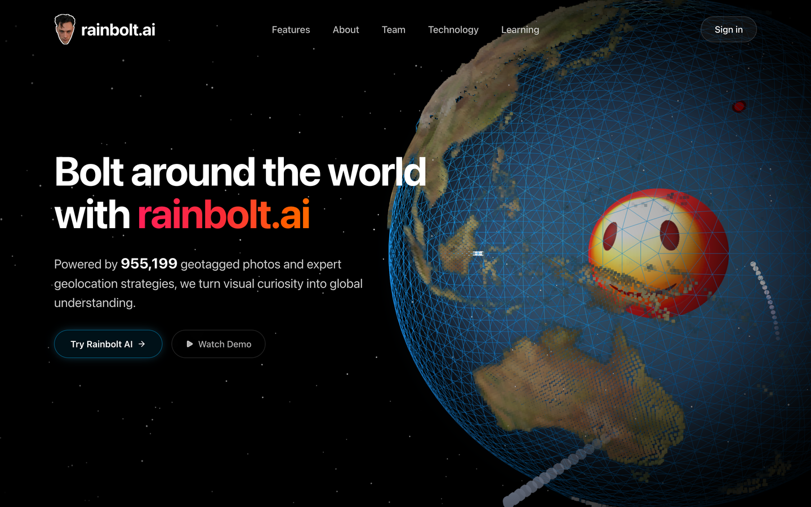
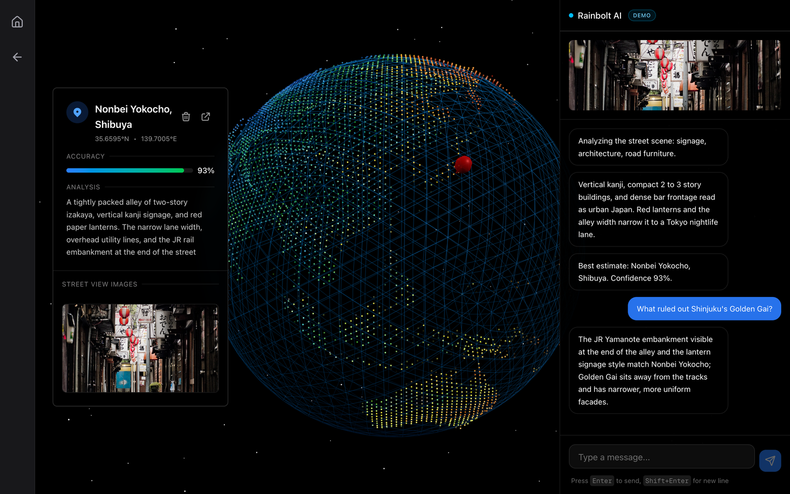
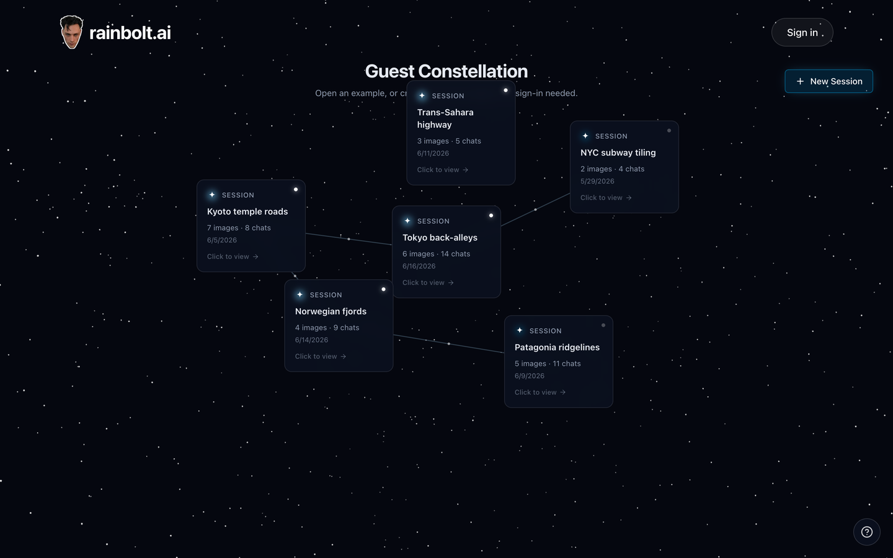

# rainbolt.ai

AI-powered geolocation: upload a photo and the system predicts where it was taken, streams its reasoning live, and verifies the guess against street-level imagery.

**[Live demo](https://rainbolt-ai.vercel.app)** &nbsp;·&nbsp; **[Devpost](https://devpost.com/software/rainbolt-ai)**




### Screenshots





This document is the developer and operator guide. For the original project story, see the [Devpost submission](https://devpost.com/software/rainbolt-ai).

## Architecture

rainbolt.ai is a retrieval-augmented geolocation pipeline. A photo flows through embedding, vector retrieval, language-model reasoning, and street-view verification before reaching the UI.

1. Upload. The browser posts an image to the Next.js route `/api/upload`. That route is a server-side proxy: it forwards the image to the FastAPI backend's `/upload-image` endpoint with a shared internal key, so the backend is never called directly from the browser.
2. CLIP embedding. The backend encodes the image with OpenAI's open-source CLIP (ViT-B/32), run locally on CPU, into a vector embedding.
3. Pinecone retrieval. The embedding is queried against a Pinecone index that holds two namespaces:
   - `images`: CLIP embeddings of geotagged reference images, each carrying `{latitude, longitude}` metadata. Nearest neighbors give candidate coordinates. Image-to-image similarity scores are high (~0.7).
   - `features`: CLIP text embeddings of GeoGuessr-style clues (bollards, road-line styles, license plates, scripts, Street View car metadata, and so on), stored as `metadata['text']`. The image embedding is matched against these text vectors to surface human-readable evidence. Image-to-text scores are low (~0.19 to 0.28), so a lower threshold (~0.22) is used for this namespace.
4. Gemini reasoning. The candidate coordinates and matched feature clues are handed to Gemini (via LangChain, `langchain_google_genai`). Gemini reasons over the evidence, narrows the location, and explains its thinking. The reasoning is streamed token by token to the client over a WebSocket so the UI can show the model working in real time.
5. Mapillary verification. The predicted coordinates are checked against Mapillary street-level imagery to confirm and contextualize the guess.
6. Presentation. The Next.js frontend renders the prediction on an interactive globe and constellation view, shows the streamed reasoning, and displays the street-view imagery.

## Tech stack

| Layer | Technologies |
|-------|--------------|
| Frontend framework | Next.js 15, React 19, TypeScript |
| Styling and UI | Tailwind CSS v4, Radix UI, framer-motion |
| 3D and visualization | Three.js |
| Client state | Zustand |
| Auth and identity | Auth0 (server-side sessions), Firebase (client) |
| Backend framework | FastAPI, uvicorn |
| Realtime transport | WebSockets |
| Embeddings | OpenAI's open-source CLIP (ViT-B/32), run locally on CPU; Pillow for image handling |
| Reasoning model | Google Gemini via LangChain (langchain_google_genai) |
| Vector database | Pinecone (namespaces: images, features) |
| Street view | Mapillary API |
| Dataset (index rebuild) | Kaggle (public geotagged image dataset) |
| Orchestration | Docker, Docker Compose |
| Deploy targets | Vercel (frontend), container host such as Cloud Run (backend) |

## Prerequisites

You can run the project either fully containerized or directly on your machine.

- With containers: Docker and Docker Compose.
- Without containers: Python 3.11 for the backend, and Node.js with bun for the frontend (the repo ships a `bun.lock`).

Accounts and API keys you will need:

- Google Gemini (the reasoning model) for `GOOGLE_API_KEY`.
- Pinecone (the vector index) for `PINECONE_API_KEY`.
- Mapillary (street-view imagery) for `MAPILLARY_API_KEY`. Optional: the app runs without it, just with no street view.
- Auth0 (user authentication).
- Firebase (client-side services).
- Kaggle (only needed to rebuild the Pinecone index from the source dataset).

## Environment variables

Configuration is split across three scopes. Each scope has its own example file. Copy each to its real filename and fill in the values.

### Root / Compose (`.env` from `.env.example`)

Read by Docker Compose. Public `NEXT_PUBLIC_*` values are baked into the frontend bundle at build time; the Auth0 secrets are injected at runtime.

| Variable | Purpose | Required |
|----------|---------|----------|
| `NEXT_PUBLIC_BACKEND_URL` | HTTP URL the browser uses to reach the backend | Yes |
| `NEXT_PUBLIC_BACKEND_WS` | WebSocket URL the browser uses for the reasoning stream | Yes |
| `NEXT_PUBLIC_FIREBASE_API_KEY` | Firebase client config | Yes |
| `NEXT_PUBLIC_FIREBASE_AUTH_DOMAIN` | Firebase client config | Yes |
| `NEXT_PUBLIC_FIREBASE_PROJECT_ID` | Firebase client config | Yes |
| `NEXT_PUBLIC_FIREBASE_STORAGE_BUCKET` | Firebase client config | Yes |
| `NEXT_PUBLIC_FIREBASE_MESSAGING_SENDER_ID` | Firebase client config | Yes |
| `NEXT_PUBLIC_FIREBASE_APP_ID` | Firebase client config | Yes |
| `NEXT_PUBLIC_FIREBASE_MEASUREMENT_ID` | Firebase client config | Optional |
| `APP_BASE_URL` | Public base URL of the frontend, used by Auth0 | Yes |
| `AUTH0_SECRET` | Cookie/session encryption secret for Auth0 | Yes |
| `AUTH0_DOMAIN` | Auth0 tenant domain | Yes |
| `AUTH0_CLIENT_ID` | Auth0 application client id | Yes |
| `AUTH0_CLIENT_SECRET` | Auth0 application client secret | Yes |
| `BACKEND_INTERNAL_KEY` | Shared secret the Next.js `/api/upload` proxy sends to the backend. Must match the backend value. | Yes |

### Backend (`backend/.env` from `backend/.env.example`)

Read by the FastAPI service.

| Variable | Purpose | Required |
|----------|---------|----------|
| `GOOGLE_API_KEY` | Gemini API key for reasoning | Yes |
| `PINECONE_API_KEY` | Pinecone API key for vector search | Yes |
| `PINECONE_INDEX_NAME` | Pinecone index name (default `htv2025`) | Yes |
| `MAPILLARY_API_KEY` | Mapillary key for street-view lookups | Optional |
| `ALLOWED_ORIGINS` | Comma-separated allowlist of browser origins permitted to open the WebSocket and call the Mapillary endpoint | Yes |
| `BACKEND_INTERNAL_KEY` | Shared secret checked on `/upload-image`. Must match the root value. | Yes |
| `ENABLE_DOCS` | Set to `1` to expose Swagger / OpenAPI docs. Leave off in production. | Optional |
| `KAGGLE_API_TOKEN` | New-style Kaggle token (`KGAT_...`), only for rebuilding the index | Optional |
| `KAGGLE_USERNAME` / `KAGGLE_KEY` | Legacy Kaggle credential pair, alternative to the token | Optional |

### Frontend (consumed via Compose, or a local `.env.local` for non-Docker dev)

The frontend reads the `NEXT_PUBLIC_*` and Auth0 variables listed in the root scope above. When running the frontend outside Docker, place those values in `frontend/.env.local`.

## Quick start with Docker Compose

```bash
# 1. Configure environment
cp .env.example .env
cp backend/.env.example backend/.env
# edit both files and fill in your keys

# 2. Build images
docker compose build

# 3. Start the stack
docker compose up -d
```

Health checks:

- Backend: `curl http://localhost:8000/`   # `{"status":"ok"}`
- Frontend: http://localhost:3000

The backend listens on port 8000 and the frontend on port 3000. Uploaded images persist to `backend/uploads` via a bind mount; the Kaggle dataset cache persists in a named volume.

## Local dev without Docker

Run the two services in separate terminals.

Backend (Python 3.11):

```bash
cd backend
python -m venv venv
source venv/bin/activate
pip install -r requirements.txt
# create backend/.env from backend/.env.example first
uvicorn main:app --reload --host 0.0.0.0 --port 8000
```

Frontend (Node + bun):

```bash
cd frontend
bun install
# create frontend/.env.local with the NEXT_PUBLIC_* and Auth0 values
bun dev
```

The frontend serves on http://localhost:3000 and the backend on http://localhost:8000.

## Rebuilding the Pinecone index

The `htv2025` index is built from CLIP embeddings of a public Kaggle dataset and can be regenerated from scratch with `ingest.py` (images) and `ingest_features.py` (text clues). This needs a Kaggle credential. See [backend/REBUILD.md](backend/REBUILD.md) for the full procedure, flags, and resumable-ingest notes.

## Security model

The backend is not meant to be hit directly from the public internet. Three gates protect it:

- Origin allowlist. `ALLOWED_ORIGINS` is a comma-separated list of permitted browser origins. The backend checks the request origin on the WebSocket connection and on the Mapillary endpoint, and rejects anything not on the list.
- Internal-key proxy gate. The browser never calls the backend's `/upload-image` directly. It posts to the Next.js `/api/upload` route, which runs server-side, attaches the shared secret `BACKEND_INTERNAL_KEY`, and forwards the request. The backend's `require_internal_key` check rejects any `/upload-image` request without the matching key. Keep the root `.env` and `backend/.env` values identical.
- Docs toggle. The Swagger / OpenAPI docs are off by default. Set `ENABLE_DOCS=1` only when you want them exposed (for example in local development), and leave it off in production.

## Deployment

- Frontend: deploy to Vercel. Set the `NEXT_PUBLIC_*` build variables and the Auth0 runtime variables in the Vercel project settings. Point `NEXT_PUBLIC_BACKEND_URL` and `NEXT_PUBLIC_BACKEND_WS` at the deployed backend.
- Backend: build the container in `backend/` and run it on a container host such as Google Cloud Run. Provide all `backend/.env` variables as service environment variables, and set `ALLOWED_ORIGINS` to the deployed frontend origin.
- Billing backstop. A GCP budget -> Pub/Sub -> Cloud Function kill switch disables billing project-wide if spend crosses a threshold, so a runaway service cannot quietly run up a bill. See [infra/billing-killswitch/README.md](infra/billing-killswitch/README.md).

## Repo layout

```
.
├── backend/                 FastAPI service: CLIP, Pinecone, Gemini, Mapillary
│   ├── main.py              FastAPI app wiring: mounts routers + CORS
│   ├── config.py            Env config, allowed origins, thresholds
│   ├── security.py          Origin allowlist + internal-key gates
│   ├── ws_manager.py        WebSocket connection management
│   ├── routers/             Route modules: upload, chat WebSocket, mapillary, health
│   ├── reasoning.py         Gemini reasoning over retrieved evidence
│   ├── pineconedb.py        Pinecone client and queries
│   ├── mapillary.py         Street-view lookups
│   ├── ingest.py            Image-namespace index build
│   ├── ingest_features.py   Feature-namespace (text clues) build
│   ├── notebooks/           Scratch/experiment notebooks
│   ├── data/                Source data (GeoGuessr feature clues)
│   └── REBUILD.md           Index rebuild guide
├── frontend/                Next.js 15 / React 19 app (bun)
│   ├── app/                 Routes, including /api/upload proxy
│   ├── components/          UI components
│   └── ...
├── infra/billing-killswitch GCP budget kill switch (Cloud Function)
├── images/                  Screenshots used in this README
├── docker-compose.yml       Two-service stack (backend, frontend)
└── .env.example             Root / compose environment template
```

## Team

Daniel Pu, Daniel Liu, Evan, Justin Wang

## License

Proprietary. Built for Hack the Valley X 2025.
